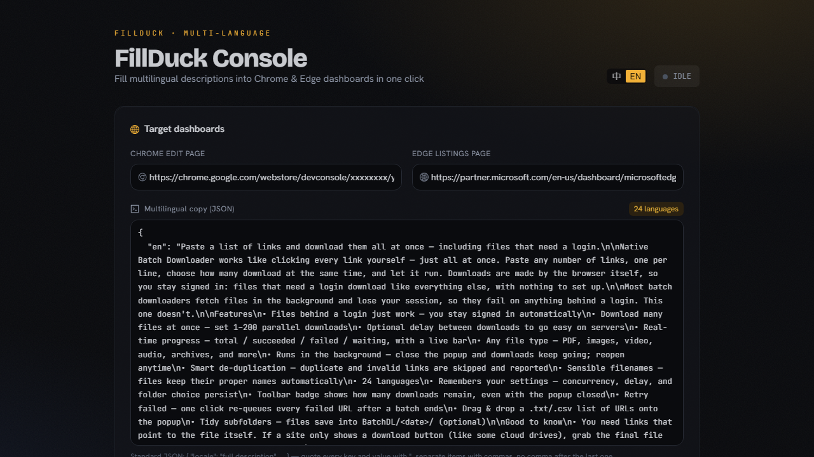
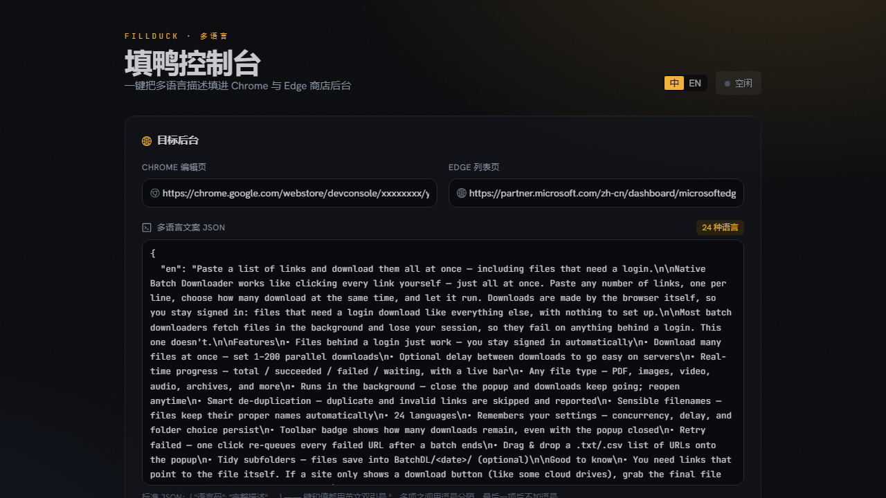
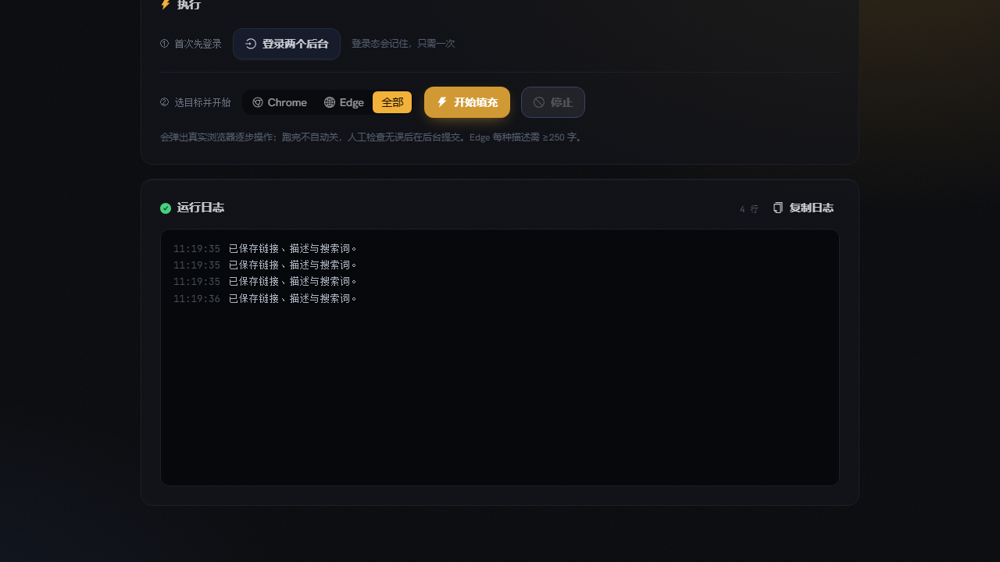

# FillDuck 填鸭

[中文](README.md) · **English**

> 365 Open Source Plan #13 · One local multilingual file, bulk-filled into the store descriptions and search terms of the Chrome Web Store and Edge Add-ons dashboards.

> One local multilingual JSON, auto-filled into the **descriptions** and **search terms** of the Chrome Web Store and Edge Add-ons dashboards. **Runs locally · bilingual · drafts only — you stay in control of publishing.**

You publish an extension in 15–20+ languages and dread re-pasting every description / search term by hand on each update. FillDuck drives **your own real browser** (your login, your machine — nothing is uploaded) to open each language, type the text in, and save a draft. You review everything and submit yourself.

## Screenshots

One screen: paste your two dashboard URLs + multilingual JSON → pick a target → Start → watch the live log. The UI toggles between 中 / English.



| 中文界面 (Chinese UI) | Run controls + live log |
| --- | --- |
|  |  |

## What it does

| Dashboard | How it fills | Verification |
| --- | --- | --- |
| **Chrome Web Store** | switches the language dropdown per locale, fills the description | clicks **Save draft** once after all languages |
| **Edge Add-ons** (Partner Center) | fills description + search terms per language, saves each draft | re-opens each to verify, retries failures (up to 3 rounds) |

- **Descriptions**: both dashboards.
- **Search terms**: Edge only (the Chrome Web Store has no such field); one set per language, rules below.

The UI and dashboards are **bilingual (中 / English)**: the console auto-detects your browser language (with a toggle); the dashboards are auto-detected (zh/en) with English fallback for any other language — your account's language setting is never changed.

## Quick start

1. Install [Node.js](https://nodejs.org/) (skip if already installed).
2. Start the console: double-click `start.bat` (Windows) or run `./start.sh` (macOS/Linux). First run installs deps and opens http://localhost:4599.
3. In the console:
   - Paste your two dashboard URLs (Chrome's `…/edit`, Edge's `…/listings`) + your descriptions JSON (optionally search-terms JSON too), click **Save**.
   - Click **Log in** → sign into Google / Microsoft in the browser window (once; remembered after).
   - Click **Start** (Chrome / Edge / All) → watch the live log → review in the browser → submit yourself.

> Use the **中 / EN** toggle (top-right) to switch the interface language (remembered). The live run-log is backend-generated and currently Chinese only.

## Description format (`descriptions.json`)

Keys are locale codes (underscore or hyphen, case-insensitive); values are the full per-language description:

```json
{
  "en": "Full description in English…",
  "zh_CN": "中文完整描述…",
  "pt-BR": "Descrição completa…"
}
```

- Not sure how to write it? Click **Load sample** in the console for an editable template, or copy `descriptions.example.json` from the repo.
- For a line break inside a description, write `\n` (a JSON string can't contain a raw newline).
- On the dashboard but missing from your copy → skipped (with a note); extra languages in your copy → ignored.
- **Edge requires ≥250 characters per description**; shorter ones are skipped with a note.
- Save as UTF-8 — with or without a BOM, both parse fine.

## Search-terms format (`search-terms.json`, Edge only)

Keys are locale codes; values are an **array** of search terms for that language:

```json
{
  "en": ["batch download", "bulk downloader", "download manager"],
  "zh_CN": ["批量下载", "批量下载器", "下载管理"]
}
```

- Edge rules (anything over is dropped automatically with a note): **≤7 terms** per language, **≤30 chars** each, **≤21 distinct words** total (deduped).
- Filling a language's terms **clears its existing terms first**, so the result exactly equals your array.
- A language with an empty array `[]` is **skipped — its existing terms are left untouched**. The console also has Load sample / Import file / Clear.
- This file is **optional**: fill descriptions only, terms only, or both.

> `config.json` (URLs), `descriptions.json`, and `search-terms.json` are git-ignored — never committed.

## FAQ

- **My dashboard isn't in Chinese — does it work?** Yes. It auto-detects a Chinese or English dashboard and adapts; any other language falls back to English. Your account language is never changed.
- **A language shows "not recognized" on Edge?** The name table is in `src/selectors.mjs`; the log prints the real name — add one line.
- **Google says "this browser may not be secure"?** See the troubleshooting section in [SETUP-playwright.md](SETUP-playwright.md).
- **Is it safe?** Fully local: login lives in `.auth-profile/`, copy in a local file, nothing is reported. On error it stops and leaves the browser open for inspection.

## Command line (optional)

```bash
npm run login    # first-time login (opens both dashboards; Ctrl+C when done)
npm run chrome   # Chrome only
npm run edge     # Edge only
npm run all      # both
```

## Layout & extending

- `playwright/` — fill logic (`fill-chrome.mjs` description, `fill-edge.mjs` description, `fill-edge-terms.mjs` search terms)
- `gui/` — local console (`gui/server.mjs`; front-end React + antd in `gui/web/src`)
- `src/` — shared pure logic: `core.mjs` (parse / queue / URL lang / search-term cleaning, unit-tested), `selectors.mjs` (selectors + bilingual name tables)
- New platform = add `playwright/fill-<platform>.mjs` + register a target in `gui/server.mjs`.

Full guide & troubleshooting: **[SETUP-playwright.md](SETUP-playwright.md)**.

## About the 365 Open Source Plan

This is project #13 of the [365 Open Source Plan](https://github.com/rockbenben/365opensource).

One person + AI, 300+ open-source projects in a year. [Submit your idea →](https://my.feishu.cn/share/base/form/shrcnI6y7rrmlSjbzkYXh6sjmzb)
